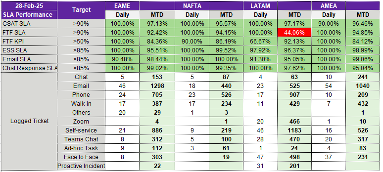

# 
SLA_Report

## Overview

The SNOW Crystal Report provides insights into various Service Level Agreements (SLAs) across multiple communication channels and regions. This is a daily report tracking performance metrics such as customer satisfaction, response efficiency, and regional performance.

## Tools & Technologies Used

- Microsoft Excel: Data organization, calculations, and visualization

## 📂 Contents

The report includes the following sections:

1. **Dashboard**: High-level visual summary of key metrics
2. **All Data**: Consolidated dataset for analysis
3. **Raw Data Sections**:
- CSAT raw data: Customer Satisfaction trends and insights
- CHAT raw data: Chat response analysis
- Response SLA raw data: Performance against SLAs

## Key SLAs Tracked in This Report

This report tracks several key SLAs across different customer interaction channels:

1. **CSAT SLA (Customer Satisfaction SLA)**: Measures how well the support team meets customer expectations based on satisfaction survey scores.
2. **FTF SLA (First Time Fix Service Level Agreement)**: Tracks the percentage of issues resolved on the first attempt without requiring follow-ups.
3. **FTF KPI (First Time Fix Key Performance Indicators)**: Measures specific performance benchmarks for first-time issue resolution.
4. **ESS SLA (Employee Self-Service SLA)**: Evaluates response and resolution times for employee self-service requests.
5. **EMAIL SLA**: Tracks response and resolution times for customer support queries received via email.
6. **CHAT SLA**: Monitors response and resolution times for real-time chat interactions.

## Regional SLA Tracking

The report also tracks SLA performance for different regions:
1. **EAME (Europe, Africa, and Middle East)**
2. **NAFTA (North American Free Trade Agreement region - US, Canada, Mexico)**
3. **LATAM (Latin America)**
4. **AMEA (Asia, Middle East, and Africa)**

Each region follow agreed SLA benchmarks and performance tracking to ensure service consistency across global operations.

## Dashboard Preview

This is a daily SLA performance report tracking customer support efficiency across different regions. It measures how well teams meet response time targets for different channels like email, chat, and face-to-face interactions. Most regions are performing well, but LATAM's face-to-face SLA (44.06%) is below target, which may indicate process inefficiencies. Email and chat have high ticket volumes, meaning fast digital support is crucial.
